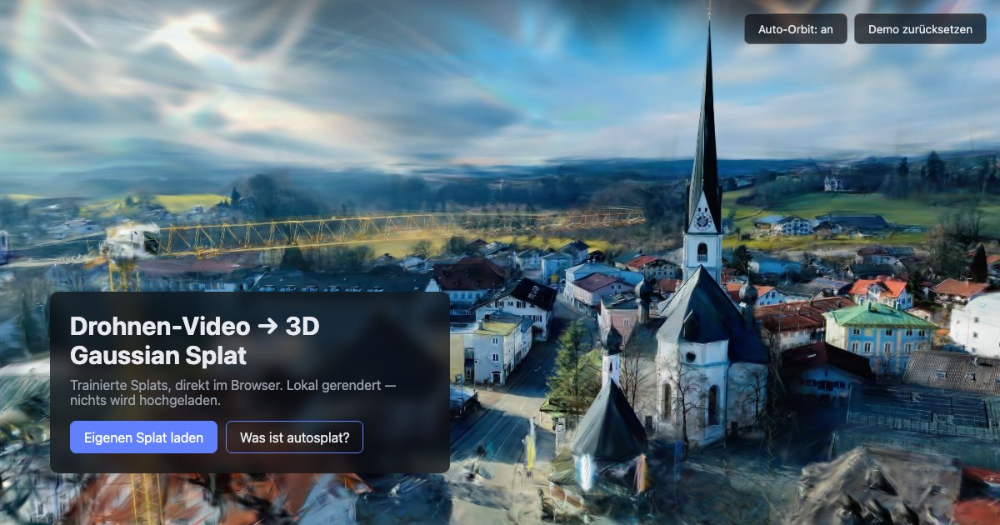
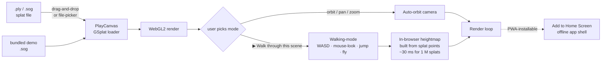

# autosplat-viewer

[](https://www.gnu.org/licenses/agpl-3.0)
[](https://codeberg.org/jkaindl/autosplat-viewer/releases)
[](https://codeberg.org/jkaindl/autosplat-viewer)
[](https://jkaindl.codeberg.page/autosplat-viewer/)
[](https://jkaindl.codeberg.page/autosplat-viewer/)
[](https://codeberg.org/jkaindl/autosplat-viewer/src/branch/main/tests)
[](#tech)

Static viewer Progressive Web App for 3D Gaussian Splats — a showcase
for the [autosplat](https://codeberg.org/jkaindl/video-to-3d-gaussian-splat)
pipeline and a general-purpose splat viewer. Vanilla HTML/CSS/JS, no
build step, no upload — everything renders locally in the browser.

**▶ Live: <https://jkaindl.codeberg.page/autosplat-viewer/>**

> **Status: v1.1.1 — Mobile + Walking-mode.** First-person walk-through
> with in-browser heightmap collision, full iPhone Safari support
> (safe-area, pseudo-fullscreen, virtual joystick), `prefers-reduced-motion`
> respected. PWA-installable, offline-capable shell.

---

<p align="center">
  <a href="https://jkaindl.codeberg.page/autosplat-viewer/" title="Open the live viewer">
    
  </a>
</p>

<p align="center"><strong><a href="https://jkaindl.codeberg.page/autosplat-viewer/">▶ Open the live viewer</a></strong></p>

---

## What it does



Everything in the diagram runs **in the browser**. No upload, no server,
no account. The PlayCanvas Engine is loaded from the jsDelivr CDN at
runtime; the rest of the site is plain static files served from Codeberg
Pages.

---

## Companion: the autosplat pipeline

This viewer is the browser-facing companion to
**[autosplat](https://codeberg.org/jkaindl/video-to-3d-gaussian-splat)** —
a local pipeline that turns drone or handheld video into trained 3D
Gaussian Splats on Apple Silicon. autosplat produces the splats; this
viewer shows them off and lets anyone inspect their own.

---

## Release status

For full per-release notes see [`CHANGELOG.md`](CHANGELOG.md).

| Version | Date       | Headline                                                                                                                                              |
| ------- | ---------- | ----------------------------------------------------------------------------------------------------------------------------------------------------- |
| v1.1.1  | 2026-05-26 | **Reduced-motion + social-card polish** — `prefers-reduced-motion` honoured (auto-orbit doesn't auto-start); `og:image:width/height` for Mastodon, Discord. |
| v1.1.0  | 2026-05-26 | **Walking-mode + Mobile / iOS** — first-person walk-through with heightmap collision, virtual joystick, full iPhone Safari support (safe-area, pseudo-fullscreen). |
| v1.0.0  | 2026-05-22 | **Initial release** — static viewer PWA on Codeberg Pages, drag-and-drop `.ply`, auto-orbit, installable, offline shell, AGPL §13 source link. |

---

## Features

- **Gaussian-Splat rendering** in the browser via the
  [PlayCanvas Engine](https://github.com/playcanvas/engine) (loaded at
  runtime from jsDelivr — no bundled binary)
- **Auto-orbit camera** that respects the OS-level
  `prefers-reduced-motion` setting
- **Orbit / pan / zoom** — left-drag, right-drag, mouse wheel
- **Walking-mode** — first-person walk-through with WASD + mouse-look
  (pointer-lock), heightmap collision built in-browser from the splat's
  own point cloud
- **Collision editor** — extract a triangle mesh from the splat (marching
  cubes on a 64³ voxel-density grid), voxel-brush-edit it (Add / Remove /
  Iso slider), export as `.obj`, save/reload via JSON sidecar. Can replace
  the heightmap as the walking-mode collider — gives you real walls.
- **Drag-and-drop** or file-picker for your own `.ply` splats (or a
  `.collision.json` sidecar to re-attach a saved collision mesh)
- **Fullscreen mode** — distraction-free, intro overlay hidden; on iPhone
  Safari a CSS pseudo-fullscreen fallback fills the gap left by missing
  Fullscreen API support for non-`<video>` elements
- **Installable PWA** with an offline-capable app shell — including a
  fully-supported "Add to Home Screen" on iOS
- **iPhone-aware UI** — safe-area handling around the notch / Dynamic
  Island / home indicator; dynamic viewport height so the stage tracks
  Mobile Safari's collapsing URL bar
- **Graceful WebGL2 fallback** to a still image when WebGL2 is
  unavailable
- **Zero npm runtime dependencies**

---

## Walking-mode

After a splat loads, a **"▶ Walk through this scene"** prompt appears
on the stage. Click it to drop into first-person mode. The viewer
builds a 128×128 heightmap from the splat's own point positions
(~30 ms for 1 M splats) and uses it as the walkable surface.

### Desktop controls

| Action                  | Key                                                       |
| ----------------------- | --------------------------------------------------------- |
| Move                    | `W` `A` `S` `D` or arrow keys                             |
| Look                    | Mouse (pointer-lock — click the canvas to re-acquire)     |
| Jump                    | `Space`                                                   |
| Sprint                  | Hold `Shift`                                              |
| Toggle fly mode         | `F`                                                       |
| Up / down (in fly mode) | `Q` / `E`                                                 |
| Adjust eye height       | Mouse wheel — setting is remembered                       |
| Exit                    | `Esc`                                                     |

### Mobile controls

| Action          | Touch                                                          |
| --------------- | -------------------------------------------------------------- |
| Move            | Drag in the **left** half of the screen (virtual joystick)     |
| Look            | Drag in the **right** half of the screen                       |
| Sprint          | Push the joystick to the rim                                   |
| Jump            | `↑` button (right edge)                                        |
| Toggle fly mode | `✈` button (right edge)                                        |
| Exit            | `✕` button (top right)                                         |

Walking-mode is tuned for **outdoor scenes captured from drone-style
flyovers** — the kind of capture `autosplat` is built for. Indoor
multi-room scenes don't work well today (collision is a heightmap, not
real walls); see
[`docs/superpowers/specs/2026-05-25-walkable-viewer-design.md`](docs/superpowers/specs/2026-05-25-walkable-viewer-design.md)
for the planned Tier-3 mesh-collision follow-up.

---

## Install as an app

The viewer is a PWA — install it for a fullscreen, app-like experience:

- **iOS (Safari):** Share → *Add to Home Screen*. Launches standalone
  with no Safari chrome — opens straight into the stage.
- **Android / desktop Chrome / Edge:** address-bar install icon, or the
  browser's "Install app" menu entry.
- **macOS Safari:** File → *Add to Dock*.

The app shell is cached by a `network-first` service worker, so
installed clients pick up updates on the next reload and still work
offline once the shell has been seen.

---

## Quick start (local development)

```bash
git clone https://codeberg.org/jkaindl/autosplat-viewer.git
cd autosplat-viewer

./serve.sh                       # → http://localhost:8123/
./tests/run.sh                   # unit + e2e
./tests/run.sh unit              # unit only (no deps)
./tests/run.sh e2e               # browser smoke (auto-installs puppeteer-core)
```

A real HTTP origin is required — Service Workers do not run on
`file://`. The shipped viewer has **zero npm runtime dependencies**;
`tests/node_modules/` is gitignored and only populated on the first
e2e run.

See
[`docs/superpowers/specs/2026-05-25-walkable-checklist.md`](docs/superpowers/specs/2026-05-25-walkable-checklist.md)
for the manual walking-mode smoke checklist and
[`AGENTS.md`](AGENTS.md) for repo conventions.

---

## Deployment — Codeberg Pages

Codeberg Pages serves the `pages` branch at
`https://jkaindl.codeberg.page/autosplat-viewer/`. The site is fully
static — update the live site with:

```bash
git push origin main         # development branch
git push origin main:pages   # publish to the pages branch
```

All asset paths are relative, so the site works under the
`/autosplat-viewer/` sub-path. The service worker's `SHELL` /
`RUNTIME` cache constants in
[`service-worker.js`](service-worker.js) must be bumped whenever a file
is added to or removed from `SHELL_FILES` so installed clients re-fetch.

---

## Tech

- **Vanilla HTML/CSS/JS** (ES modules), no build step, no transpilation
- **PlayCanvas Engine** loaded at runtime from jsDelivr (`+esm`
  importmap) — kept out of the cached shell so a CDN update doesn't
  require a deploy
- **PWA** — `manifest.webmanifest`, maskable icon, network-first
  service worker
- **iOS-first mobile** — `viewport-fit=cover`, safe-area-inset padding,
  CSS pseudo-fullscreen fallback, `100dvh` stage
- **Tests** — `node:test` unit (zero deps) + `puppeteer-core` e2e
  (auto-installed into `tests/node_modules/`)

---

## Contributing

See [`CONTRIBUTING.md`](CONTRIBUTING.md). Issues and pull requests are
welcome — please keep the shipped site vanilla.

For agent-side conventions (AI-pair commits, log conventions, the
release flow) see [`AGENTS.md`](AGENTS.md).

## Security

See [`SECURITY.md`](SECURITY.md) for the reporting channel and scope.

## Citation

Academic / research use — see [`CITATION.cff`](CITATION.cff) or click
*Cite this repository* on the Codeberg sidebar.

## License

GNU Affero General Public License v3.0 or later
(**AGPL-3.0-or-later**) — see [`LICENSE`](LICENSE).

This is the same license autosplat uses: contributions to the commons
stay in the commons, even when the software is served over a network.
Because this viewer runs as a network-served application, the footer
links to its own source — as required by AGPL §13.

The PlayCanvas Engine is MIT-licensed and loaded as a separate
component from a CDN.

Copyright © 2026 Johannes Kaindl. Licensed under AGPL-3.0-or-later.
