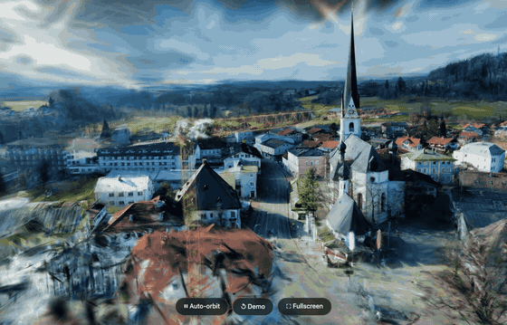

# autosplat-viewer

[](https://www.gnu.org/licenses/agpl-3.0)
[](https://jkaindl.codeberg.page/autosplat-viewer/)

Static viewer PWA for 3D Gaussian Splats — a showcase for the
[autosplat](https://codeberg.org/jkaindl/video-to-3d-gaussian-splat)
pipeline and a general-purpose splat viewer.

**▶ Live: <https://jkaindl.codeberg.page/autosplat-viewer/>**



Renders Gaussian Splats in the browser via the PlayCanvas Engine — the
bundled demo is a compressed `.sog`; drop your own `.ply` splat to view
it. No build step, no server, no upload — everything renders locally.

## Features

- Live Gaussian-Splat rendering with auto-orbit
- Orbit / pan / zoom camera (left-drag, right-drag, mouse wheel)
- Drag-and-drop or file-picker for your own `.ply` splats
- Fullscreen mode — distraction-free, intro overlay hidden
- Installable PWA with an offline-capable app shell
- Graceful WebGL2 fallback to a still image

## Local development

```bash
./serve.sh        # → http://localhost:8123/
```

A real http origin is required — Service Workers do not run on `file://`.

## Deployment — Codeberg Pages

Codeberg Pages serves the `pages` branch at
`https://jkaindl.codeberg.page/autosplat-viewer/`. The site is fully
static — update the live site with:

```bash
git push origin main         # development branch
git push origin main:pages   # publish to the pages branch
```

All asset paths are relative, so the site works under the
`/autosplat-viewer/` sub-path.

## Tech

Vanilla HTML/CSS/JS (ES modules), no build step. The PlayCanvas Engine
is loaded at runtime from the jsDelivr CDN. PWA: installable, with an
offline app shell.

## Relationship to autosplat

This viewer is the browser-facing companion to
[autosplat](https://codeberg.org/jkaindl/video-to-3d-gaussian-splat) — a
local pipeline that turns drone or handheld video into trained 3D
Gaussian Splats. autosplat produces the splats; this viewer shows them
off and lets anyone inspect their own.

## Contributing

Issues and pull requests are welcome. The viewer is intentionally small
and build-step-free — please keep changes vanilla HTML/CSS/JS.

## License

GNU Affero General Public License v3.0 or later (AGPL-3.0-or-later) —
see [LICENSE](LICENSE).

This is the same license autosplat uses: contributions to the commons
stay in the commons, even when the software is served over a network.
Because this viewer runs as a network-served application, the footer
links to its own source — as required by AGPL §13.

The PlayCanvas Engine is MIT-licensed and loaded as a separate
component from a CDN.

Copyright (C) 2026 Johannes Kaindl. Licensed under AGPL-3.0-or-later.
